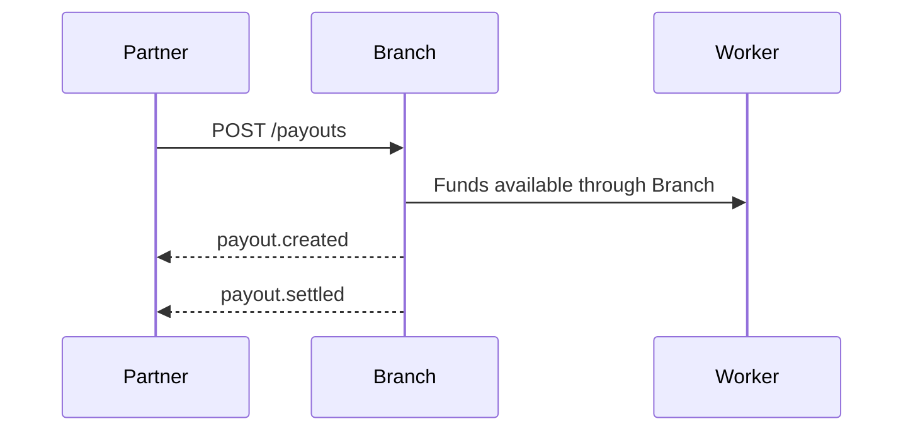

# Webhooks

Branch sends webhook events when payout and worker states change.

## Recommended subscriptions

| Event | Use when |
| --- | --- |
| `payout.created` | A payout request is accepted. |
| `payout.failed` | A payout needs retry or operator review. |
| `payout.settled` | Funds are available or settled. |
| `dispute.opened` | A transaction dispute was created. |


Validate webhook signatures and retry delivery with exponential backoff.

