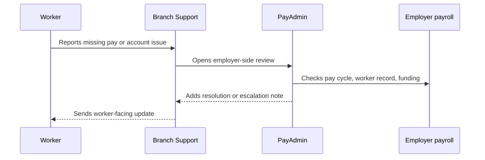

# Worker support review

Worker support usually starts in the Branch app or help center. PayAdmin adds employer-side context when the issue depends on payroll setup, payout timing, or workforce records.

## Review questions

* Is the worker's Branch account active and matched to the right employer?
* Is the payout expected, sent, pending, returned, cancelled, or blocked?
* Is there a known bank holiday, cutoff, funding, or employer-file delay?
* Is the support response worker-facing, employer-facing, or both?



**Suggested PayAdmin response**

Attach the payout ID, employer ID, worker external ID, status reason, funding state, next action, and confidence level before handing back to support.


